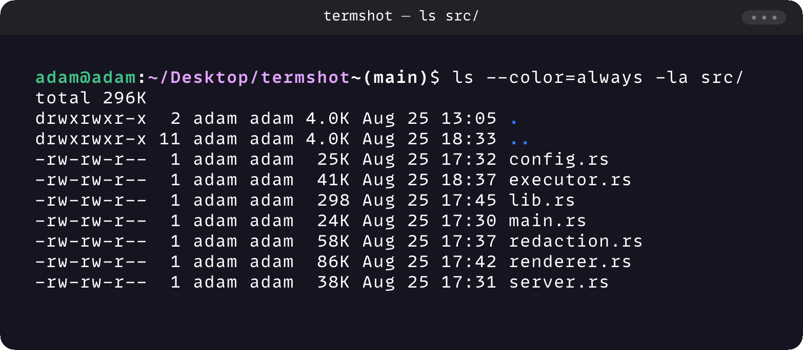
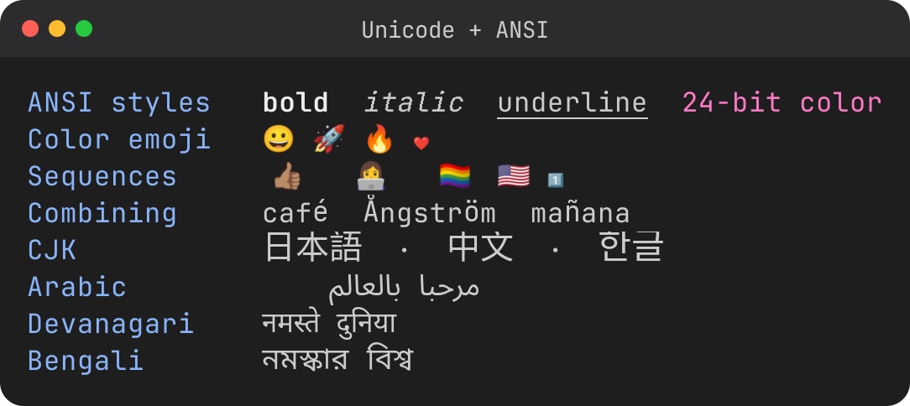
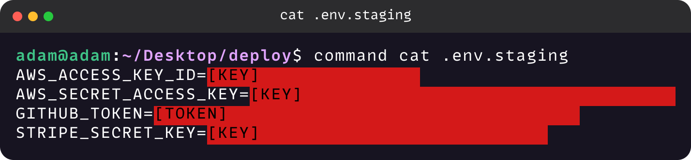
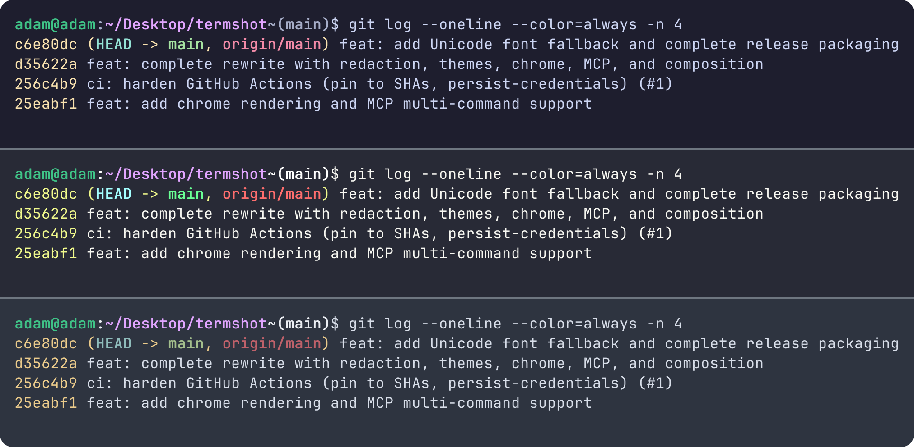
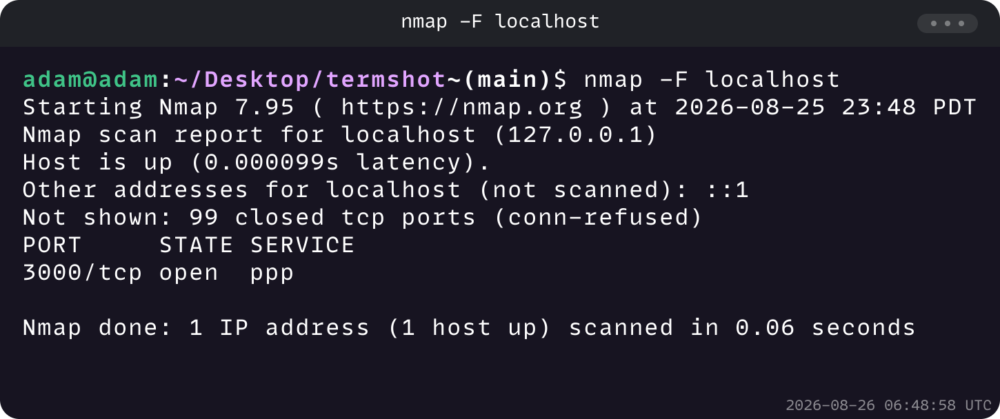
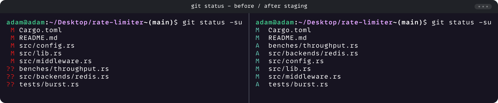

<h1 align="center">termshot</h1>

<p align="center">
  Terminal screenshots as PNGs, with ANSI colors fully rendered.
</p>

<p align="center">
  <a href="https://github.com/Adamkadaban/termshot/releases"></a>&nbsp;
  <a href="./LICENSE"></a>&nbsp;
  
</p>

---

Run a command, get a PNG that looks like your terminal. Works as a
standalone CLI and as an MCP server for AI agents. Built for pentest
reports, blog posts, and PR descriptions.

<p align="center">
  
</p>

```sh
termshot exec --chrome gnome --title 'termshot - ls src/' 'ls --color=always -la src/'
```

## Highlights

**Real ANSI rendering** - colors, bold, italic, underline, Unicode, rendered
at 2x resolution with your own font. Commands run in a PTY through your login
shell, so your prompt, aliases, and `PATH` are in the image.

<p align="center">
  
</p>

```sh
termshot exec 'git log --graph --oneline --color=always -n 6'
```

**Redaction** - opt-in masking of secrets in the image (`--redact`, or
`auto = true` in config). The text returned to the caller keeps the originals,
so an agent can inspect it and selectively redact.
See [docs/redaction.md](./docs/redaction.md).

<p align="center">
  
</p>

```sh
termshot exec --redact --chrome gnome 'command cat .env.staging'
```

**Themes** - 11 built-in (using the bundled JetBrains Mono), plus any themes you
drop in `~/.config/termshot/themes/`, each with its own fonts.

<p align="center">
  
</p>

```sh
for theme in catppuccin-mocha dracula nord; do
  termshot exec --theme "$theme" --no-rounded -o "$theme.png" \
    'git log --oneline --color=always -n 4'
done
termshot compose --divider 4 -o themes.png \
  catppuccin-mocha.png dracula.png nord.png
```

**Your prompt, whatever it is** - commands run through your login shell, so the
prompt in the image is the one your own shell config draws. Prompts are
independent of termshot themes, which only set colors, font, and background:
the four panes below are four different shell prompts in the one built-in
`dark` theme.

<p align="center">
  
</p>

Starship, Powerlevel10k, Oh My Zsh themes, or a hand-rolled `PS1` show up the
same way. The image uses isolated shell configs so it does not modify the
user's normal setup.

```sh
TERMSHOT_SHELL=/path/to/shell-wrapper termshot exec \
  --theme dark -o prompt.png 'git status -sb'
termshot compose --divider 4 -o prompts.png prompt-*.png
```

**Chrome frames** - title bar presets with optional timestamp. Good for
reports and blog posts.

<p align="center">
  
</p>

```sh
termshot exec --chrome gnome --timestamp 'nmap -F localhost'
```

**Composition** - combine screenshots side by side or stacked (tmux-style)
for before/after comparisons.

<p align="center">
  
</p>

```sh
termshot exec -o before.png 'git status -su'
git add -A
termshot exec -o after.png 'git status -su'
termshot compose --layout horizontal --chrome gnome \
  --title 'git status - before / after staging' -o compose.png before.png after.png
```

**Accessible by default** - every PNG embeds its terminal text (redacted, when
redaction ran) in a UTF-8 `Description` chunk so screen readers can read the
screenshot. Turn it off with `--no-description` or `embed_description = false`.

**MCP server** - four tools for agent workflows:
`execute_and_screenshot`, `render_ansi`, `redact_screenshot`,
`compose_screenshots`.

## Install

```sh
git clone https://github.com/Adamkadaban/screenshot-mcp termshot
cd termshot
cargo build --release
# binary at ./target/release/termshot
```

Tagged releases also publish Linux (x86_64, aarch64, static musl) and macOS
(Intel, Apple Silicon) binaries plus `.deb` and `.rpm` packages.

Linux and macOS only: termshot uses PTYs and POSIX signals.

## Usage

```sh
termshot exec 'ls --color=always -la'                          # basic screenshot
termshot exec --chrome gnome --theme dracula 'git log'         # chrome + theme
termshot exec --redact 'cat credentials.txt'                   # mask secrets
termshot exec --no-rounded 'ls --color=always'                 # square corners
termshot compose -o diff.png before.png after.png              # stack two shots
termshot themes                                                # list themes

# render pre-captured ANSI without executing anything, from a file or a pipe
cmd --color=always | termshot render -
termshot render output.log --redact
```

## Tips

```sh
termshot exec '!!'                            # your shell expands !! first
termshot exec 'command cat .env.staging'      # bypass a cat -> bat alias
termshot exec --no-prompt 'cat .env.staging'  # no prompt, no aliases
alias tshot='termshot exec'
```

## MCP server

Add to your MCP client config:

```json
{
  "mcpServers": {
    "termshot": {
      "command": "/path/to/termshot",
      "args": ["mcp"]
    }
  }
}
```

## Docs

- [docs/mcp.md](./docs/mcp.md) - MCP setup, tool reference, agent workflows
- [docs/themes.md](./docs/themes.md) - built-in and user themes, fonts, fallback
- [docs/redaction.md](./docs/redaction.md) - rules, custom rules, partial redaction
- [docs/config.md](./docs/config.md) - `config.toml` reference

## License

[MIT](./LICENSE)
